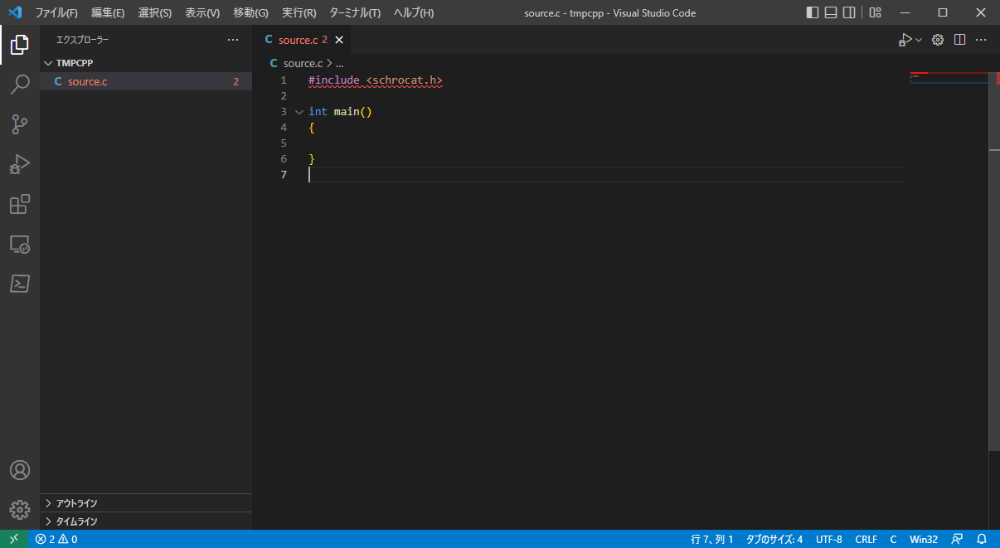
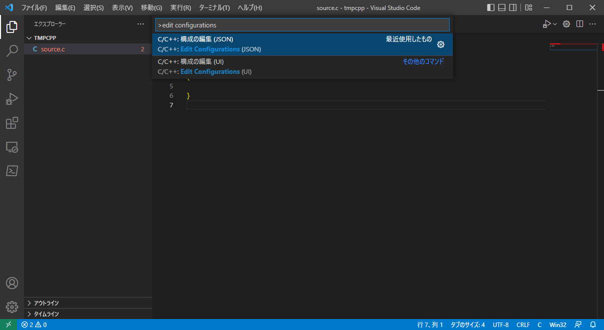
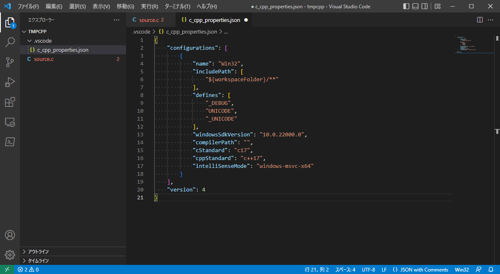

<!--

This document is written in Markdown.
You can preview on such as VisualStudio Code.
If you want to know more, search with "vscode markdown" or refer to official document https://code.visualstudio.com/Docs/languages/markdown .

-->

# GCC option

## Include

includeする際に`#include <>`とアングルブラケットで書くものと`#include ""`とダブルクォーテーションで書くものがある。

違いは、前者はカレントディレクトリのファイルを探す。そしてカレントディレクトリにそのファイルがない場合はgccなどコンパイラで指定されている`includeディレクトリ`を探しに行く。後者は直接、指定されている`includeディレクトリ`を探しに行く。
つまり標準ライブラリを使う場合は、`#include <stdio.h>`のように直接`includeディレクトリ`を探しに行く。これはもし同名のファイルがカレントディレクトリにあった場合に読み込まないようにする事ができるという利点があり、普通ライブラリを呼び出す場合は`#include <>`を使う。仕組み的には結局`includeディレクトリ`を探しに行くため、`#include "stdio.h"`としてもコンパイルできるわけである。


## 規定のincludeディレクトリ

`gcc`の規定の`includeディレクトリ`は以下のコマンドで表示できる。

```
gcc -x c -v -E /dev/null
```

## includeディレクトリの追加

`-I`オプションを付けることでincludeディレクトリのパスを追加することができる。

```
gcc -I_ADDITIONAL_PATH_1_ -I_ADDITIONAL_PATH_2_
```

または環境変数"PATH"に追加することで規定のincludeディレクトリを追加することができる。
例えば.bashrcに以下のように追記する。`source`コマンドでリロードする必要がある。

```
# ~/.bashrc

export PATH=$PATH:-I_ADDITIONAL_PATH_1_:_ADDITIONAL_PATH_2_
```

## エディタのincludeディレクトリ

コンパイル時は以上の設定でうまくincludeをすることができるが、エディターの`syntax highlight`では別途パスを通す必要がある。

以下はVSCodeの例である。

1. .cファイルがあるディレクトリを開く。

	標準ライブラリにないため、includeでエラーが出ていることがわかる。

	

2. 設定の作成

	コマンドパレット(Ctrl + Shift + P)を開き
	```
	> edit configurations
	```
	これによりそのディレクトリのVSCodeの設定ファイル、".vscode"ディレクトリとC/C++の設定ファイル"c_cpp_properties.json"が作成される。知っての通り、ピリオドから始まるファイル名はLinuxなどでは隠しファイルとして扱われる。(Windowsでは表示されるが)

	

3. c_cpp_properties.jsonの編集

	jsonの記法に従って"include"に任意の`includeディレクトリ`を追加する。
	これで"#include <>"とした`includeディレクトリ`も関数を探しに行くため、うまくsyntax highlightされる。

	


# オブジェクトファイル

実行ファイルを作るという動作は、関数などを機械語に翻訳(`Compile`)し、それを繋ぎ合わせて(`Link`)一つの実行ファイルを作成する。(この一連の動作を`Build`、広義で`Compile`と呼ぶ。)

そしてLinkせずにただCompileしたオブジェクトのまま置いておくこともある。

これはファイルごとにCompileしておくことで、一部を変更したときにすべてをCompileし直す面倒を避けるなどの理由がある。

オブジェクトを作成するオプションが`-c`で、拡張子は`.o`ある。


たとえば"func.c"と"main.c"があった場合、それぞれオブジェクトファイルにして

```
gcc -c -o func.o func.c
gcc -c -o main.o main.c
```

これで"func.o"と"main.o"ができあがる。このままだと実行できないのでリンクするときは今までと同様に

```
gcc func.o main.o
```
で"a.out"の実行ファイルが作成できる。


<!-- Written by Croyfet in 2022-->
